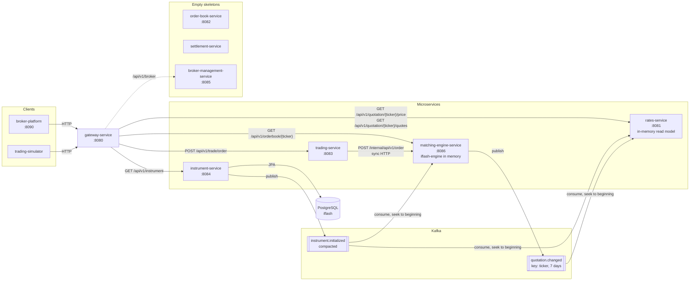
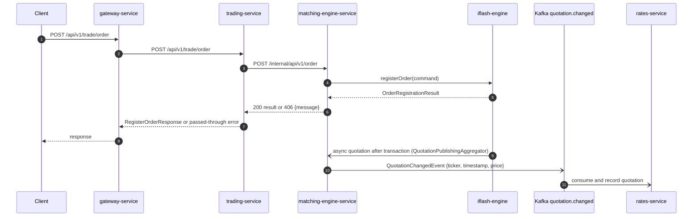
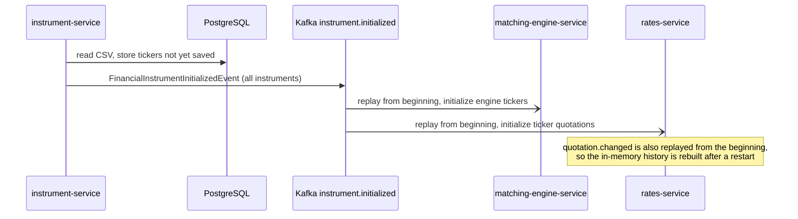

# iFlash architecture (2026-11-24)

State after splitting the `iflash-platform` monolith into microservices.

## Components

```mermaid
flowchart LR
    subgraph clients["Clients"]
        broker["broker-platform<br/>:8090"]
        simulator["trading-simulator"]
    end

    gateway["gateway-service<br/>:8080"]

    subgraph services["Microservices"]
        instrument["instrument-service<br/>:8084"]
        rates["rates-service<br/>:8081<br/>in-memory read model"]
        trading["trading-service<br/>:8083"]
        mes["matching-engine-service<br/>:8086<br/>iflash-engine in memory"]
    end

    subgraph skeletons["Empty skeletons"]
        obs["order-book-service<br/>:8082"]
        settlement["settlement-service"]
        bms["broker-management-service<br/>:8085"]
    end

    subgraph kafka["Kafka"]
        topicInstrument[["instrument.initialized<br/>compacted"]]
        topicQuotation[["quotation.changed<br/>key: ticker, 7 days"]]
    end

    postgres[("PostgreSQL<br/>iflash")]

    broker -->|HTTP| gateway
    simulator -->|HTTP| gateway

    gateway -->|"GET /api/v1/instrument"| instrument
    gateway -->|"GET /api/v1/quotation/{ticker}/price<br/>GET /api/v1/quotation/{ticker}/quotes"| rates
    gateway -->|"POST /api/v1/trade/order"| trading
    gateway -->|"GET /api/v1/orderbook/{ticker}"| mes
    gateway -.->|"/api/v1/broker"| bms

    trading -->|"POST /internal/api/v1/order<br/>sync HTTP"| mes

    instrument -->|JPA| postgres
    instrument -->|publish| topicInstrument
    topicInstrument -->|consume, seek to beginning| mes
    topicInstrument -->|consume, seek to beginning| rates
    mes -->|publish| topicQuotation
    topicQuotation -->|consume, seek to beginning| rates
```

## Order placement

```mermaid
sequenceDiagram
    autonumber
    participant Client as Client
    participant Gateway as gateway-service
    participant Trading as trading-service
    participant MES as matching-engine-service
    participant Engine as iflash-engine
    participant Kafka as Kafka quotation.changed
    participant Rates as rates-service

    Client->>Gateway: POST /api/v1/trade/order
    Gateway->>Trading: POST /api/v1/trade/order
    Trading->>MES: POST /internal/api/v1/order
    MES->>Engine: registerOrder(command)
    Engine-->>MES: OrderRegistrationResult
    MES-->>Trading: 200 result or 406 {message}
    Trading-->>Gateway: RegisterOrderResponse or passed-through error
    Gateway-->>Client: response
    Engine-)MES: async quotation after transaction (QuotationPublishingAggregator)
    MES-)Kafka: QuotationChangedEvent {ticker, timestamp, price}
    Kafka-)Rates: consume and record quotation
```

## Startup and initialisation

```mermaid
sequenceDiagram
    participant Instrument as instrument-service
    participant DB as PostgreSQL
    participant Kafka as Kafka instrument.initialized
    participant MES as matching-engine-service
    participant Rates as rates-service

    Instrument->>DB: read CSV, store tickers not yet saved
    Instrument->>Kafka: FinancialInstrumentInitializedEvent (all instruments)
    Kafka-)MES: replay from beginning, initialize engine tickers
    Kafka-)Rates: replay from beginning, initialize ticker quotations
    Note over Rates: quotation.changed is also replayed from the beginning,<br/>so the in-memory history is rebuilt after a restart
```
